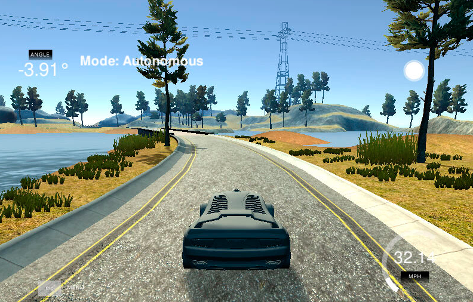
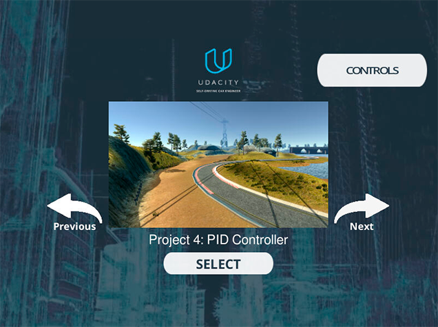
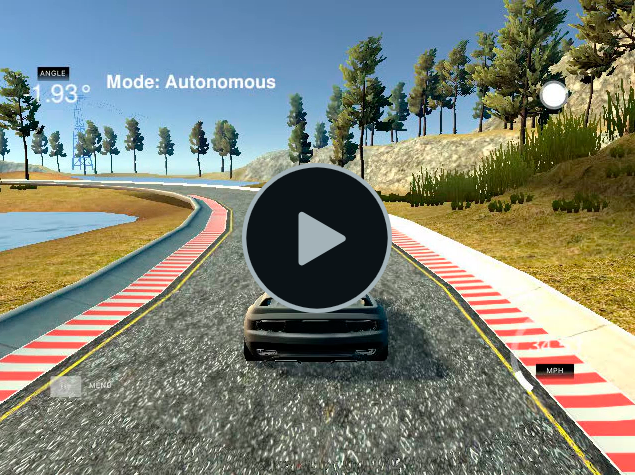

# CarND - PID Controller - Poject 8
Udacity Self-Driving Car Engineer Nanodegree Program <br>
[](http://www.udacity.com/drive)

<p align="center">

</p>

# Overview

PID stands for Proportional-Integral-Differential. These three components are combined in such a way that it produces a control signal. The goals / steps of this project is to implement a PID controller in C++ to maneuver the vehicle around the track in Udacity’s [simulator](https://github.com/udacity/self-driving-car-sim/releases). The simulator sends cross-track error, speed and angle to the PID controller (PID) using WebSocket and it receives the steering angle and the throttle to drive the car. The PID uses the [uWebSockets](https://github.com/uNetworking/uWebSockets) WebSocket implementation.

My code for this project is publicly available and can be found here: <br>https://github.com/ednaldogoncalves/CarND-PIDControl-P8

## Steps

- You can use the project version on repository [here](https://github.com/udacity/CarND-PID-Control-Project).

- If you decide to work in your local setup, you can download the latest simulator [here](https://github.com/udacity/self-driving-car-sim/releases). To run the simulator on Mac/Linux, first make the binary file executable with the following command:
```shell
sudo chmod u+x {simulator_file_name}
```
- The code should stand on its own as redable material. Explain in code comments, as well as in your write-up, how your code works and why you wrote it that way.

- Make it easy for a reviewer to understand your code.

- The speed limit has been increased from 30 mph to 100 mph. Get ready to channel your inner Vin Diesel and try to drive SAFELY as fast as possible! **NOTE: you don't have to meet a minimum speed to pass**.

## Basic Build Instructions

1. Clone this repo.
2. Make a build directory: `mkdir build && cd build`
3. Compile: `cmake .. && make`
4. Run it: `./pid`. 


## Dependencies

* cmake >= 3.5
 * All OSes: [click here for installation instructions](https://cmake.org/install/)
* make >= 4.1(mac, linux), 3.81(Windows)
  * Linux: make is installed by default on most Linux distros
  * Mac: [install Xcode command line tools to get make](https://developer.apple.com/xcode/features/)
  * Windows: [Click here for installation instructions](http://gnuwin32.sourceforge.net/packages/make.htm)
* gcc/g++ >= 5.4
  * Linux: gcc / g++ is installed by default on most Linux distros
  * Mac: same deal as make - [install Xcode command line tools]((https://developer.apple.com/xcode/features/)
  * Windows: recommend using [MinGW](http://www.mingw.org/)
* [uWebSockets](https://github.com/uWebSockets/uWebSockets)
  * Run either `./install-mac.sh` or `./install-ubuntu.sh`.
  * If you install from source, checkout to commit `e94b6e1`, i.e.
    ```
    git clone https://github.com/uWebSockets/uWebSockets 
    cd uWebSockets
    git checkout e94b6e1
    ```
    Some function signatures have changed in v0.14.x. See [this PR](https://github.com/udacity/CarND-MPC-Project/pull/3) for more details.
* Simulator. You can download these from the [project intro page](https://github.com/udacity/self-driving-car-sim/releases) in the classroom.

Fellow students have put together a guide to Windows set-up for the project [here](https://s3-us-west-1.amazonaws.com/udacity-selfdrivingcar/files/Kidnapped_Vehicle_Windows_Setup.pdf) if the environment you have set up for the Sensor Fusion projects does not work for this project. There's also an experimental patch for windows in this [PR](https://github.com/udacity/CarND-PID-Control-Project/pull/3).


## Files

My project consists of the following files:

- **README.md** (writeup report) documentation of the results.
- **main.cpp** The main c++ file that implements the communication with the simulator.
- **PID.cpp** The actual implementation of the PID Controller update the cross-track error to use around in the track.
- **videos** - videos recording of your vehicle driving autonomously in the track.

## Project [Rubric](https://review.udacity.com/#!/rubrics/1972/view)

### Compilation

To build the project using the `make` command after creating the **build** folder, as per previous instructions above. This is an example of the output of this script:

```shell
root@03436e1036f3:/home/workspace/CarND-PID-Control-Project/build# make
Scanning dependencies of target pid
[ 33%] Building CXX object CMakeFiles/pid.dir/src/PID.cpp.o
[ 66%] Building CXX object CMakeFiles/pid.dir/src/main.cpp.o
[100%] Linking CXX executable pid
[100%] Built target pid
root@03436e1036f3:/home/workspace/CarND-PID-Control-Project/build# 
```

The project could be executed directly using `./pid`

```shell
root@03436e1036f3:/home/workspace/CarND-PID-Control-Project/build# ./pid
Listening to port 4567
```

Now the path planner is running and listening on port 4567 for messages from the simulator. Next step is to open Udacity's simulator:

<p align="center">

</p>


 The code compiles without errors or warnings. No modifications were done on the provided setup.

### Implementation

Before getting into the implementation, let’s discuss the PID controller components. I am going to discuss based on how to use PID for steering angles.

##### Cross Track Error
A cross track error is a distance of the vehicle from trajectory. In theory it’s best suited to control the car by steering in proportion to Cross Track Error(CTE).

The PID implementation is done on the [./src/PID.cpp](./src/PID.cpp). The [PID::UpdateError](./src/PID.cpp#L41) method calculates proportional, integral and derivative errors and the [PID::TotalError](./src/PID.cpp#L67) calculates the total error using the appropriate coefficients.

### Reflection

#### The effect of the P, I, D component of the PID algorithm
PID controllers are a class of algorithms that can be used not only to steer self-driving vehicles but also have many other applications.

It encompasses of three controllable parameters and if tuned properly can be incredibly effective and accurate. The three parameters are proportional gain (P), integral gain (I), and derivative gain (D), hence the name PID.

- #### P component
The "P" for **proportional** means that the car will steer in proportion to the cross-track error, or CTE. The component had the most directly observable effect on the car’s behaviour. It causes the car to steer proportional (and opposite) to the car’s distance from the lane center(CTE). If the car is far to the right it steers hard to the left, if it’s slightly to the left it steers slightly to the right. CTE is essentially how far from the middle line of the road the car is. 
If used alone, the car overshoots the central line very easily and go out of the road very quickly. An example video where this component is used alone:

<p align="center">
<br>
<a href="./src/Videos/only_proportional.mp4">Download video</a>
</p>

- #### I component
The "I" for **integral** sums up all CTEs up to that point, such that too many negative CTEs (in this case, meaning the car has been to the left of the middle of the lane for awhile) will drive up this value, causing the car to turn back toward the middle, preventing the car from driving on one side of the lane the whole time. The integral portion tries to eliminate a possible bias on the controlled system that could prevent the error to be eliminated.
If used alone, it makes the car to go in circles. In the case of the simulator, no bias is present. An example video where this component is used along:

<p align="center">
<br>
<a href="./src/Videos/only_integral.mp4">Download video</a>
</p>

- #### D component
The "D" for **differential** is the change in CTE from one value to the next. The differential component causes the output to decrease if the process variable is increasing rapidly. The differential response is proportional to the rate of change of the process variable. Increasing the differential parameter will cause the control system to react more strongly to changes in the error term and will increase the speed of the overall control system response. Most practical control systems use very small differential parameter, because the Differential Response is highly sensitive to noise in the process variable signal. If the sensor feedback signal is noisy or if the control loop rate is too slow, the differential response can make the control system unstable.
The differential portion helps to counteract the proportional trend to overshoot the center line by smoothing the approach to it. An example video where this component is used alone:

<p align="center">
<br>
<a href="./src/Videos/only_differential.mp4">Download video</a>
</p>

#### Final hyperparameters
I decided to manually tune the hyperparameters. I first tried to implement twiddle, but it was difficult to implement and didn’t give me a good result. I decided to discard the twiddle implementation and found my effort to manually optimize the hyperparameters. In a second moment I will improve the code. I choose to set **P** to **0.15**, **I** to **0.004** and **D** to **2.5**. I first tried with all the three hyperparameters close to 1, but the car went off road. I had to drastically diminish to make the car stay on track. To optimize driving I had to drastically increase D to make the car stay on track recovering from errors. I played a little with ``throttle`` and ``steer_value`` to increase the speed of the car, increasing its performance and to control the speed and maximum steer anlge in the curves. You can read the code in the main.cpp file (lines [87:107](./src/main.cpp#L87)).

```shell
//To control the speed and maximum steer anlge
steering = rad2deg(steer_value);

throttle = 0.5;
//maximum steer angle -+25 degrees
max_steering_angle = 25;

if (steering > max_steering_angle) {
  steering = max_steering_angle;
}
if (steering < - max_steering_angle) {
  steering = - max_steering_angle;
}
if (steering > 10 && speed > 35) {
  throttle = -0.5;
}

if (steering < -10 && speed > 35) {
  throttle = -0.5;
}

steer_value = deg2rad(steering);
```

After the car drove the track without going out of it, the parameters increased to minimize the average cross-track error on a single track lap.

<p align="center">
Full video of the track lap executed in the project<br>
<a target="_blank" style="text-decoration: none" href="https://www.lgontelecom.com.br/udacity/project8/full_results.html"></a><br>
<a href="./src/Videos/full_results.mp4">Download video</a>
</p>
